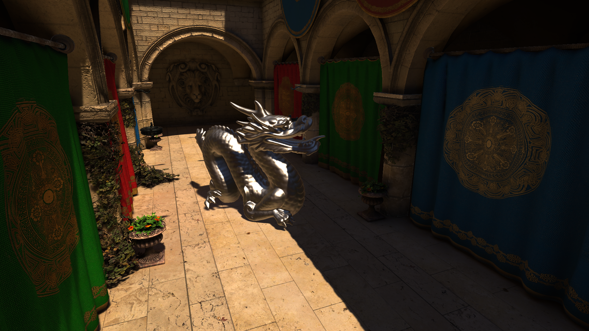

# PJRP
 
> **TODO:** A work-in-progress custom Render Pipeline for Unity, built from scratch using the Core RP library.

## Extended Capabilities

- **Translucent shadows.** Translucent geometry cast dithered shadows.
- **Better spot lights.** Inner and outer spot light angle can be tweaked in editor.

## Up-coming Features

- Point and spot shadows.
- Post porcessing layers.
- Anti-aliasing.
- Support for dynamic resolution sacaling.

## Planned Features

- Deferred path support.
- Ray-traced shadows.
- Ray-traced reflections.